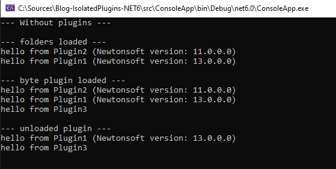

# Revisiting an older post
As I still see some activity on GitHub for my older [post](/blog/post/creating-isolated-plugins-dotnetcore/) regarding creating isolated plugins and I find it an interesting concept, so I though I would revisit this topic and create an updated version for NET6.

This post will be a continuation/replacement of [my previous post](/blog/post/creating-isolated-plugins-dotnetcore/) and might not cover and explain all cases.

And as a notice, I know there already are quite a few packages that tries to solve the problem with managing plugins, but in my experience loading and managing plugins are often very specific for the application and existing tools will not match all wanted functionality. So I want to share this to at least help show a base on what is possible without using any third-party packages.

## Creating a demo environment

This part will almost be identical to my previous post, but with the addition of another plugin project.

**ConsoleApp:** This project would represent my project that will load the plugins and be the hosting application.

**PluginBase:** A shared library, that all plugins will add a reference to and contains a set of interfaces that plugins can implement so that the hosting application can detect them.

**Plugin1:** The first example plugin, that have a reference the PluginBase project and to Newtonsoft.Json 13.0.1.

**Plugin2:** The second example plugin, that have a reference the PluginBase project and to Newtonsoft.Json 11.0.1.

**Plugin3:** The third example plugin, without any external references except the PluginBase project.

The code for the example interface would look the file PluginBase.cs and the implementation of the interface in one of the plugin projects would look like Plugin.cs.

$[IPluginBase.cs](csharp,3,6)

$[Plugin.cs](csharp,5,11)

## An updated solution

The solution will not be that much of a difference from the old solution, as it will still be using the abstract class *AssemblyLoadContext*. **But** the code will be more of a complete solution and also use the updated API.

Here I will show the full implementation of the context where each instance will represent a plugin and below will follow an explanation of each section.

$[PluginContext.cs](csharp,6,48)

### Constructor

The constructor will take information about which assemblies that are shared with the hosting application.

The *sharedTypes* parameter should be all types that we want to load later from the hosting application within the plugin, in our case **IPluginBase**. This is because if one of these types exists in one of the loaded DLL files it will be loaded in a different context then the hosting application. This will result in that the hosting application and the plugin context will not share the assembly for these types and the hosting application wont be able to load instances of these types from the plugin context.

The *Id* property will in this example just be a GUID to identity the plugin.

### InitializeFromFolder(string path)

This method will load all DLL files that can be found in the specified folder into this context. The if statement will check so that any DLL that any of the shared types is not loaded from the plugin. As this would load that DLL into the plugin context.

### InitializeFromBytes(byte[] assembly)

This method will load an DLL file from a byte array. The concept behind this is the same as loading DLL files from a folder, but the source of the DLL file can be for example be a stream extracted from a .zip or downloaded from the internet.

### Load(AssemblyName assemblyName)

The *Load* method is an overidden method that the context will call when any of the loaded DLL files have a reference to an assembly (DLL) that was not included in the initialization.

An example might be that a plugin have reference to the System.IO to work with files, this is a reference that exists in the runtime and will therefor be loaded from the runtime with static *Assembly.Load* method.

This will also occur for any references to a assembly for a shared type, this is why there is an if statement. This will catch this and return the reference to the assembly that is loaded the application context. This will create the behavior that the types can be shared between the contexts.

## Wrapping it together

To have this case cover a more real scenario, I decided to wrap the plugins in a generic manager class. In our test case it will be used like this: **new PluginManager<IPluginBase>()**

In simple it is just a class that contains a list of plugins with some wrapping methods. The methods are more described below the code.

$[PluginManager.cs](csharp,5,59)

### Load

The load methods are just a wrapping methods for the PluginContext.Load methods but with the additional code to create a new instance of a plugin, even for example a folder is tried to be loaded twice.
Of course this can be change to match other requirements, for example checking if a folder is already loaded and return the already existing plugin context.

### Unload

Here is one of the more interesting parts that is new from my previous post, that was added in .NET Core 3, the possibility to unload an assembly context.
This functionallity will result in that we can add a method to unload a plugin from the hosting application.

**Note:** If you read in the Unload [documentation](https://docs.microsoft.com/en-us/dotnet/api/system.runtime.loader.assemblyloadcontext.unload?view=net-6.0) from Microsoft it states a few remarks.
One is that a context (plugin) can not be unloaded if it is in use, so make sure to implement the possibility to cleanup the usage of your plugins.

### GetImplementations()

This method is a helper method to find all types that implements the generic interface or class and creates instances of them from your loaded plugins to use within the hosting application.

## Using the result

With all the above in place it should now be fairly simple to load a plugin and find implemented solution like in this example.

$[Program.cs](csharp)

And using the example project from [GitHub](https://github.com/trembon/Blog-IsolatedPlugins-NET6/blob/main/src/ConsoleApp/Program.cs), the output will be as this image (It might differ if Plugin1 or Plugin2 gets unloaded, as the sorting is random based on the genereted GUID).

## Final notes

So with this example you should have a base to implement your own plugin manager in an application that will match your needs, even if it is downloading .zip files and unpacking them in the memory or just load all .dll files in a folder.

And if you want to view the full solution, this [GitHub Repository](https://github.com/trembon/Blog-IsolatedPlugins-NET6) contains all the code this post is based on.